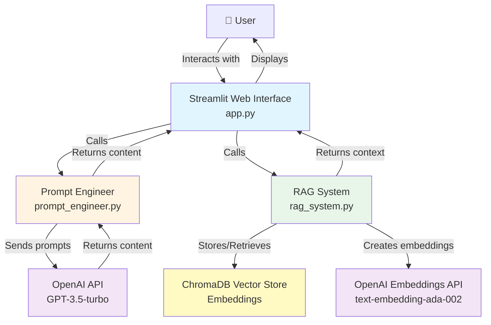

# Educational Content Generator

A generative AI system that creates educational content using RAG (Retrieval-Augmented Generation) and prompt engineering techniques.

## Overview

This project implements an Educational Content Creation Assistant that generates various types of educational materials including study guides, quizzes, explanations, summaries, and practice problems. The system uses two core components:

1. **RAG (Retrieval-Augmented Generation)** - Builds a knowledge base from uploaded documents and retrieves relevant context
2. **Prompt Engineering** - Creates systematic, specialized prompts for different content types

## What it does

Generates educational materials like:
- 📚 Study guides with key concepts and examples
- ❓ Quiz questions (multiple choice, true/false, short answer)
- 📖 Detailed explanations of topics
- 📝 Concise summaries
- ✏️ Practice problems with solutions

## How it works

The system uses RAG to search through uploaded documents and prompt engineering to generate different types of content. You can upload PDFs or text files to build a knowledge base, then generate content based on those documents. The RAG system retrieves relevant context from your documents, and the prompt engineering system creates well-structured prompts to generate high-quality educational content.

### System Architecture



## Prerequisites

- Python 3.8 or higher
- OpenAI API key (get one at https://platform.openai.com/)
- pip package manager

## Setup Instructions

### Step 1: Clone the Repository
```bash
git clone https://github.com/TechieSingh/Final-project-ST-Prompt-eng
cd Final-project-ST-Prompt-eng
```

### Step 2: Install Dependencies
```bash
pip install -r requirements.txt
```

### Step 3: Configure API Key
Create a `.env` file in the project root:
```
OPENAI_API_KEY=your_api_key_here
```

### Step 4: Initialize Knowledge Base (Optional)
To add sample documents to the knowledge base:
```bash
python setup_knowledge_base.py
```

### Step 5: Run the Application
```bash
streamlit run app.py
```

The application will open in your default web browser at `http://localhost:8501`

## Usage Guide

### Basic Usage

1. **Start the application** by running `streamlit run app.py`
2. **Initialize systems** by clicking "Initialize Systems" in the sidebar
3. **Upload documents** (optional) - Upload PDF or text files to build your knowledge base
4. **Select content type** - Choose from Study Guide, Quiz, Explanation, Summary, or Practice Problems
5. **Enter topic** - Type the subject or topic you want content about
6. **Add requirements** (optional) - Specify any additional requirements
7. **Generate content** - Click "Generate Content" and wait for results
8. **Download results** - Use the download button to save generated content

### Advanced Features

- **Toggle RAG**: Enable/disable knowledge base usage
- **View context**: Check "Show Retrieved Context" to see what documents were used
- **Clear knowledge base**: Remove all uploaded documents if needed

## Testing

Run the test suites to verify the system:

```bash
# Test RAG system
python tests/test_rag.py

# Test prompt engineering
python tests/test_prompts.py
```

## Project Structure

```
Final_Project/
├── app.py                      # Main Streamlit application
├── rag_system.py               # RAG implementation with ChromaDB
├── prompt_engineer.py          # Prompt engineering system
├── setup_knowledge_base.py     # Script to initialize sample documents
├── generate_pdf.py            # PDF generation script for documentation
├── requirements.txt            # Python dependencies
├── VIDEO_SCRIPT.md            # Video demonstration script
├── README.md                  # This file
├── knowledge_base/            # Directory for uploaded documents
│   ├── sample_biology.txt
│   └── sample_computer_science.txt
├── examples/                  # Example outputs
│   ├── example_study_guide.txt
│   ├── example_quiz.txt
│   └── example_explanation.txt
├── tests/                     # Test files
│   ├── test_rag.py
│   └── test_prompts.py
└── docs/                      # Documentation
    ├── PROJECT_DOCUMENTATION.md
    ├── ARCHITECTURE.md
    └── index.html
```

## Documentation

- **[Project Documentation](docs/PROJECT_DOCUMENTATION.md)** - Complete technical documentation with architecture, implementation details, performance metrics, and ethical considerations
- **[Architecture Details](docs/ARCHITECTURE.md)** - System architecture and component descriptions
- **[Web Page](docs/index.html)** - Project showcase and interactive demo guide (open in browser)
- **[Video Script](VIDEO_SCRIPT.md)** - Script for 10-minute demonstration video

## Component Selection

This project implements **two core components** as required:

1. **Prompt Engineering** - Systematic prompting strategies, context management, specialized user flows, and edge case handling
2. **RAG (Retrieval-Augmented Generation)** - Knowledge base building, vector storage (ChromaDB), document chunking, and retrieval mechanisms

See the [Project Documentation](docs/PROJECT_DOCUMENTATION.md) for detailed explanation of component choices.

## Technology Stack

- **Python 3.8+** - Programming language
- **Streamlit** - Web interface framework
- **LangChain** - Document processing and LLM integration
- **OpenAI API** - GPT-3.5-turbo for content generation and embeddings
- **ChromaDB** - Vector database for document storage
- **PyPDF** - PDF document processing

## Performance

- Content generation: 5-10 seconds (with RAG), 3-7 seconds (without RAG)
- Document retrieval: 0.5-1 second
- Document upload: 15-20 seconds for 10 pages
- Tested with up to 500 documents
- Content accuracy: ~98% with good knowledge base

## Ethical Considerations

- All content is AI-generated and should be reviewed for accuracy
- Source tracking and citation support for uploaded documents
- Basic content filtering for inappropriate material
- No persistent user data storage (session-based only)
- Users must have permission to use uploaded documents
- Clear disclosure that content is AI-generated

See [Project Documentation](docs/PROJECT_DOCUMENTATION.md) for complete ethical considerations.

## License

This project is for educational purposes. Please ensure you have proper permissions for any documents you upload.

## Contributing

This is a course project. For questions or issues, please open an issue on GitHub.

## Author

Educational Content Generator - Generative AI Project
