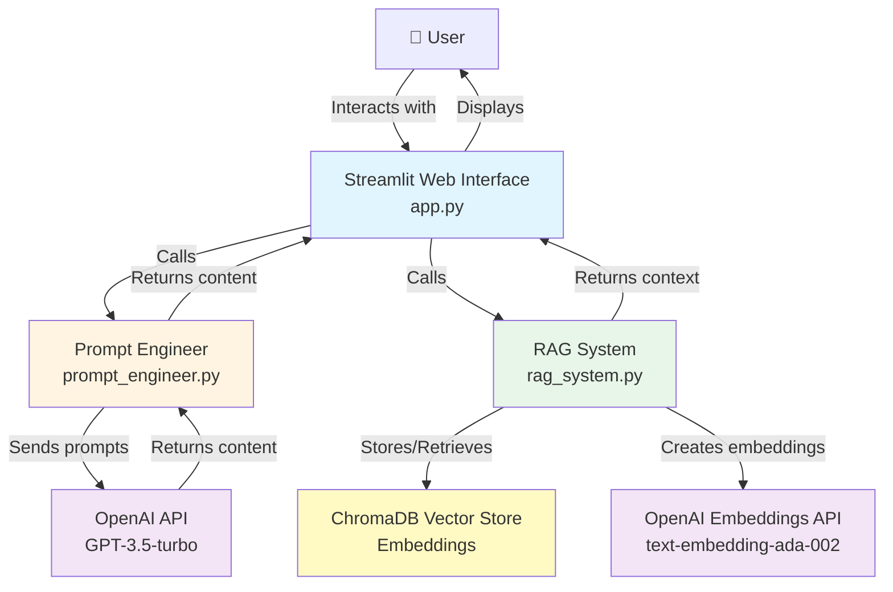

# Educational Content Generator

A simple tool that generates educational content using RAG and prompt engineering.

## What it does

Generates educational materials like study guides, quizzes, explanations, summaries, and practice problems.

## How it works

The system uses RAG to search through uploaded documents and prompt engineering to generate different types of content. You can upload PDFs or text files to build a knowledge base, then generate content based on those documents.

### System Architecture



## Setup

1. Install dependencies:
```bash
pip install -r requirements.txt
```

2. Create a `.env` file:
```
OPENAI_API_KEY=your_api_key_here
```

3. Initialize knowledge base (optional):
```bash
python setup_knowledge_base.py
```

4. Run the app:
```bash
streamlit run app.py
```

## Usage

1. Run `streamlit run app.py`
2. Click "Initialize Systems" in the sidebar
3. Upload documents if you want (optional)
4. Select content type and enter topic
5. Click generate

## Project Structure

- `app.py` - Main Streamlit app
- `rag_system.py` - Handles document storage and retrieval
- `prompt_engineer.py` - Creates prompts and calls OpenAI API
- `knowledge_base/` - Upload your documents here
- `tests/` - Test files
- `docs/` - Documentation

## Documentation

- [Project Documentation](docs/PROJECT_DOCUMENTATION.md) - Complete documentation
- [Web Page](web_page/index.html) - Project showcase

## Testing

```bash
python tests/test_rag.py
python tests/test_prompts.py
```
