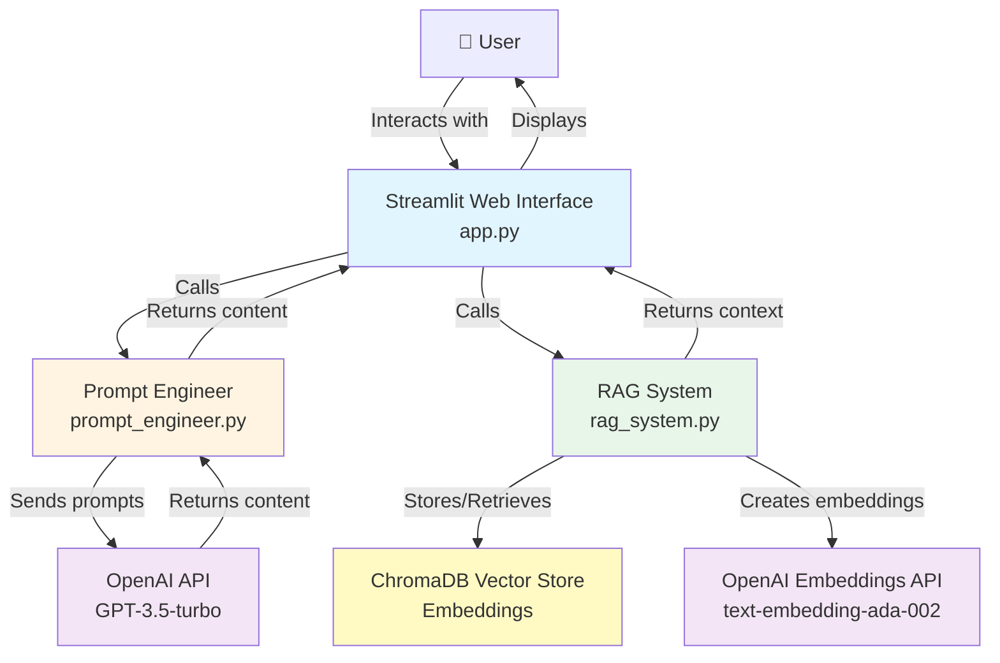

# System Architecture

## Overview

The project has three main parts: RAG system (handles documents), prompt engineering (creates prompts), and web interface (user interaction).

## Architecture

### System Architecture Diagram

## Components

### 1. RAG System (rag_system.py)

Handles document loading, chunking, embedding, and retrieval.

**How it works:**
1. Upload document (PDF or TXT)
2. Split into chunks (1000 chars, 200 overlap)
3. Create embeddings using OpenAI
4. Store in ChromaDB
5. When searching, embed query and find similar chunks

### 2. Prompt Engineering (prompt_engineer.py)

Builds prompts for different content types and integrates RAG context.

**Prompt Structure:**
- System message: Defines AI role
- Human message: Content type, topic, context from RAG, requirements

### 3. Web Interface (app.py)

Streamlit app for user interaction.

**Features:**
- Content type selection
- Document upload
- Topic input
- Content generation
- Download results

## Technology Stack

- Python 3.8+
- Streamlit
- LangChain
- OpenAI API
- ChromaDB

## Data Flow

**With RAG:**
1. User enters topic
2. RAG searches knowledge base
3. Prompt engineer builds prompt with context
4. Send to OpenAI
5. Display result

**Without RAG:**
1. User enters topic
2. Prompt engineer builds prompt (no context)
3. Send to OpenAI
4. Display result
